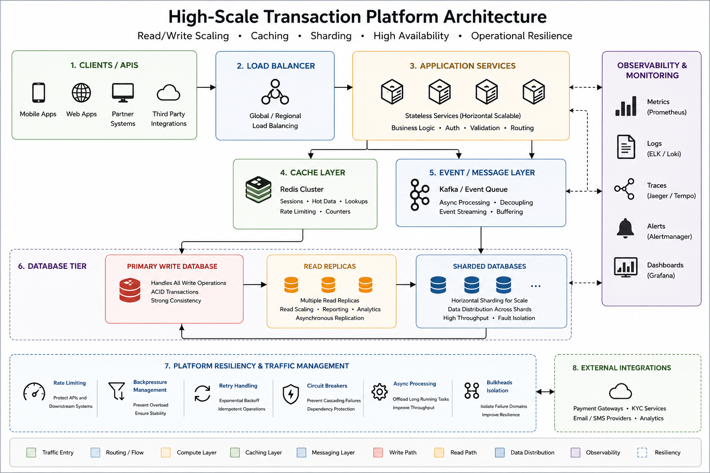

# High-Scale Transaction Platforms

This repository contains architecture patterns, scalability strategies, and operational considerations commonly used while building high-volume transactional platforms and distributed backend systems.

As systems scale, transaction processing becomes much more than simply increasing database capacity.

Long-term scalability usually depends on:

* workload distribution
* read/write separation
* caching strategy
* asynchronous processing
* operational observability
* traffic management
* partitioning approaches
* failure isolation
* consistency tradeoffs

The examples and documentation in this repository focus on practical approaches engineering organizations commonly use while scaling financial systems, transactional platforms, and high-throughput backend services.

## Topics Covered

* High-volume transaction processing
* Distributed database architecture
* Read/write scaling patterns
* Database sharding strategies
* Caching approaches
* Asynchronous processing
* Event-driven transaction workflows
* Consistency tradeoffs
* Reliability engineering
* Operational scalability

## Example Areas

### Read/Write Scaling

Patterns for:

* primary/replica architecture
* read scaling
* write coordination
* query isolation
* workload balancing
* transactional consistency

---

### Caching Strategies

Examples demonstrating:

* Redis caching
* cache invalidation
* session management
* hot data optimization
* distributed cache coordination
* throughput optimization

---

### Database Partitioning & Sharding

Operational approaches for:

* horizontal partitioning
* tenant isolation
* key distribution
* shard routing
* rebalancing strategies
* scalability tradeoffs

---

### Event-Driven Transaction Processing

Patterns covering:

* asynchronous workflows
* Kafka-based event pipelines
* retry coordination
* reconciliation workflows
* failure recovery
* operational resiliency

---

## Design Philosophy

The most scalable transaction systems are usually designed around operational simplicity, predictable failure handling, and workload isolation.

As platforms grow, the operational model often becomes more important than the database technology itself.

Reliable transaction systems typically prioritize:

* consistency boundaries
* operational visibility
* controlled scalability
* resiliency
* observability
* recovery workflows

rather than purely maximizing throughput.

---

## Disclaimer

Examples are intentionally simplified and generalized for architectural discussion and educational purposes.

## High-Scale Transaction Architecture

