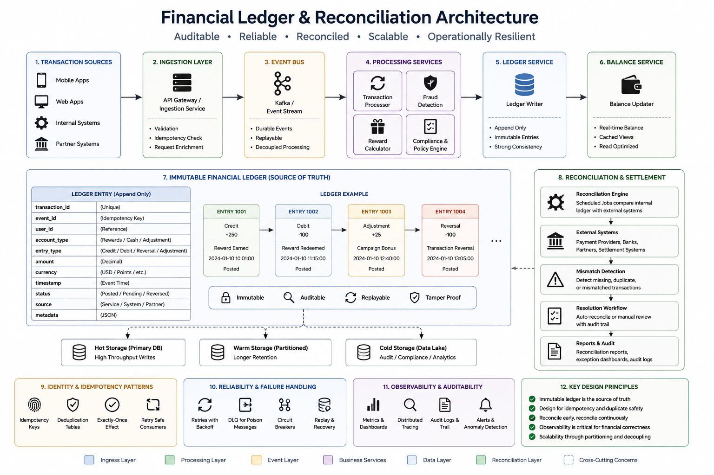

# Financial Ledger and Reconciliation Patterns

As financial systems scale, maintaining transaction correctness becomes increasingly important across distributed services, asynchronous workflows, and event-driven architectures.

In high-volume transaction systems, operational failures are unavoidable:

* retries
* duplicate events
* delayed processing
* dependency outages
* partial failures
* replay workflows
* reconciliation mismatches

The goal is not eliminating failures entirely.

The goal is designing systems that remain operationally reliable, auditable, and financially correct even when failures occur.

## Why Ledger-Based Systems Matter

One of the most common patterns in financial platforms is maintaining an immutable ledger as the source of truth for transactional activity.

Rather than directly mutating balances across multiple systems, ledger-based architectures append transaction entries representing:

* credits
* debits
* adjustments
* reversals
* settlements
* reconciliations

This improves:

* auditability
* traceability
* replayability
* operational recovery
* reconciliation workflows

Ledger-based systems also simplify downstream analytics and financial reporting because every transaction remains historically visible.

## Immutable Transaction Principles

In distributed financial systems, immutable transaction records help reduce operational ambiguity during:

* incident recovery
* replay workflows
* reconciliation investigations
* fraud analysis
* audit reviews

Instead of overwriting records, systems typically:

* append new events
* track state transitions
* preserve historical transaction lineage

This becomes especially important in:

* rewards systems
* payment platforms
* fintech applications
* marketplace transactions
* asynchronous financial workflows

## Reconciliation Workflows

Eventual consistency alone is usually not sufficient for financial correctness.

Most mature financial systems include reconciliation workflows that periodically validate:

* internal ledger entries
* external payment provider data
* settlement systems
* downstream reporting systems
* transactional balances

The goal is identifying:

* missing transactions
* duplicate processing
* settlement mismatches
* delayed events
* synchronization failures

Reconciliation systems commonly include:

* scheduled comparison jobs
* replay support
* audit trails
* mismatch detection
* operational alerting

## Idempotency and Duplicate Protection

Distributed systems should generally assume duplicate delivery.

Duplicate processing can emerge from:

* retry behavior
* consumer restarts
* network failures
* replay operations
* asynchronous retries

Financial systems commonly use:

* idempotency keys
* transaction identifiers
* deduplication tables
* consumer safeguards
* reconciliation validation

to maintain transactional correctness.

## Operational Observability

Operational visibility becomes increasingly important as transaction volume scales.

Strong observability practices often include:

* distributed tracing
* transaction correlation IDs
* replay visibility
* anomaly detection
* operational dashboards
* audit logging
* latency monitoring

In financial systems, operational observability is often just as important as application functionality.

## Consistency Tradeoffs

Most large-scale financial systems balance both:

* strong consistency
* eventual consistency

depending on the workflow.

Examples:

* transaction ledgers may prioritize strong consistency
* analytics systems may tolerate eventual consistency
* customer notifications may process asynchronously

The key is understanding where consistency guarantees are operationally necessary versus where asynchronous scalability is acceptable.

## Final Thoughts

The most scalable financial systems are usually designed around operational clarity, auditability, controlled failure handling, and predictable recovery workflows.

As transaction systems grow, operational maturity often becomes just as important as the underlying architecture itself.

Strong financial platforms are rarely defined solely by throughput.

They are defined by their ability to remain reliable, understandable, and operationally trustworthy at scale.

## Reference Architecture

